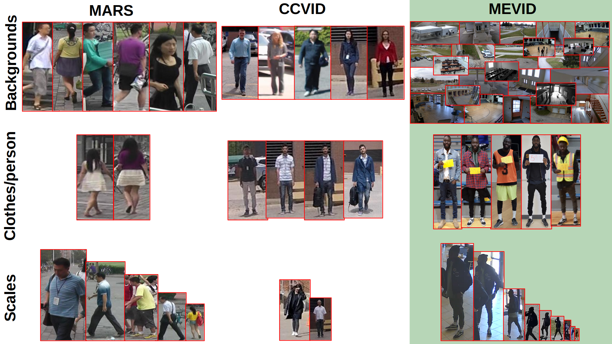
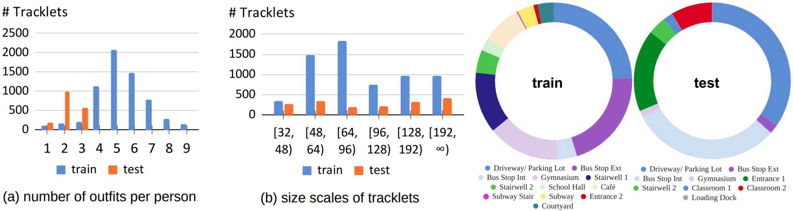

This repository hosts the source code of our paper: [[WACV 2023] MEVID: Multi-view Extended Videos with Identities for Video Person Re-Identification](https://arxiv.org/pdf/2211.04656.pdf). In this work, we present a new large-scale video person re-identification (ReID) dataset.
Specifically, we label the identities of 158 unique people wearing 598 outfits taken from 8,092 tracklets, average length of about 590 frames, seen in 33 camera views from the very large-scale [MEVA](https://mevadata.org/) person activities dataset. 



**Abstract**: In this paper, we present the Multi-view Extended Videos with Identities (MEVID) dataset for large-scale, video person re-identification (ReID) in the wild. To our knowledge, MEVID represents the most-varied video person ReID dataset, spanning an extensive indoor and outdoor environment across nine unique dates in a 73-day window, various camera viewpoints, and entity clothing changes. Specifically, we label the identities of 158 unique people wearing 598 outfits taken from 8,092 tracklets, average length of about 590 frames, seen in 33 camera views from the very-large-scale MEVA person activities dataset. While other datasets have more unique identities, MEVID emphasizes a richer set of information about each individual, such as: 4 outfits/identity vs. 2 outfits/identity in CCVID, 33 view-points across 17 locations vs. 6 in 5 simulated locations for MTA, and 10 million frames vs. 3 million for LS-VID. Being based on the MEVA video dataset, we also inherit data that is intentionally demographically balanced to the continental United States. To accelerate the annotation process, we developed a semi-automatic annotation framework and GUI that combines state-of-the-art real-time models for object detection, pose estimation, person ReID, and multi-object tracking. We evaluate several state-of-the-art methods on MEVID challenge problems and comprehensively quantify their robustness in terms of changes of outfit, scale, and background location. Our quantitative analysis on the realistic, unique aspects of MEVID shows that there are significant remaining challenges in video person ReID and indicates important directions for future research.


## Dataset
The dataset package is provided via the [MEVA](https://mevadata.org/index.html) site. The dataset proper has three components:
1) `mevid-v1-bbox-train` (6 dates over 9 days): There are 104 global identities in this folder, with 485 outfits in 6,338 tracklets. The training package is available via [https://mevadata-public-01.s3.amazonaws.com/mevid-annotations/mevid-v1-bbox-train.tgz](https://mevadata-public-01.s3.amazonaws.com/mevid-annotations/mevid-v1-bbox-train.tgz) (30.5GB)
2) `mevid-v1-bbox-test` (3 dates over 5 days): There are 54 global identities in this folder (gallery+query), with 113 outfits and 1,754 tracklets. The test package is available via [https://mevadata-public-01.s3.amazonaws.com/mevid-annotations/mevid-v1-bbox-test.tgz](https://mevadata-public-01.s3.amazonaws.com/mevid-annotations/mevid-v1-bbox-test.tgz) (13GB)
3) `mevid-v1-annotation-data`: The associated annotation databases for the test and train folders can be found in [https://mevadata-public-01.s3.amazonaws.com/mevid-annotations/mevid-v1-annotation-data.zip](https://mevadata-public-01.s3.amazonaws.com/mevid-annotations/mevid-v1-annotation-data.zip). Their file formats are described below.

Installation instructions for these packages may be found below.

**Additional supporting data** includes:
- The supporting 976 5-minute video clips (127GB) are a subset of the [entire MEVA dataset](https://mevadata.org/index.html#getting-data). Alternatively, we have supplied a list of [individual video URLs](mevid-v1-video-URLS.txt); this list may be used with `fetch`, `wget`, etc. to download the individual videos.
- Actor check-in photos are available at [https://mevadata-public-01.s3.amazonaws.com/mevid-annotations/mevid-v1-actor-checkin-photos.zip](https://mevadata-public-01.s3.amazonaws.com/mevid-annotations/mevid-v1-actor-checkin-photos.zip) (600MB).

**Naming Rule of the bboxes**:
In bbox "0201O003C330T004F00192.jpg", "0201" is the ID of the pedestrian. "O003" denotes the third outfit of this person. "C330" denotes the index of camera. "T004" means the 4th tracklet. "F00192" is the 192th frame within this tracklet. For both tracklets and frames, the index starts from 0.

**File formats**:

The annotation package `mevid-v1-annotation-data` consists of five files:

1. `query_IDX.txt`
2. `track_train_info.txt`
3. `track_test_info.txt`
4. `train_name.txt`
5. `test_name.txt`

These files are used by the data loaders in the baseline algorithms; their format is as follows:

`query_IDX.txt`: This is a list of offsets into `track_test_info.txt` that forms the query partition of the test data; images not listed in `query_IDX.txt` form the gallery.

`(train, test)_name.txt`: These are the names of the image chip jpeg files; the names are formatted as described above.

`(train, test)_info.txt`: These track files have five columns:

1. start_index
2. end_index
3. person_id
4. outfit_id
5. camera_id

Start_index and end_index are offsets into the associated `(train, test)_name.txt` file containing the tracklet chips. For example, the first line of `track_train_info.txt` (after conversion to integers) is `0 9 103 20 424`; this is parsed as:

- The track starts at line #`0` and ends at image #`9` in `train_name.txt`.
- The person ID is `103`.
- The outfid ID is `20`.
- The camera ID is `424`, corresponding to camera G424 in the MEVA dataset.

**Annotation toolchain**:

The tool used to annotate MEVID is [available here](https://mevadata-public-01.s3.amazonaws.com/tools/mevid-annotation-tool-snapshot.tgz). The tool is a fork of our [DIVE tool](https://kitware.github.io/dive/), with some specialized components to handle actor linking and data management. The installation process follows the same docker-compose process as that for DIVE in general, [described here](https://github.com/Kitware/dive/blob/main/server/README.md). The specialized components may have some rough edges in terms of hard-coded specific assumptions about the MEVA data (pathnames, number of enrollment pictures, and so forth.)

Our annotation tools are under active development and supported as project funds allow, with no guarantees that issues or feature requests will be addressed on any given timeline. If you have a particular capability you'd like added, Kitware accepts support contracts of virtually any size; contact us at `mevadata (at) kitware.com` for more information.

**Dataset statistics**:



## Installation
1. Check out this repository; for these instructions, we assume it has been checked out into a directory named `mevid-checkout`.
2. Create a sibling directory to `mevid-checkout` named `mevid`.
3. Download the `bbox_train`, `bbox_test`, and `mevid-v1-annotation-data` data packages described above.
4. Unpack each data package in the `mevid` directory. The final directory structure should be:
```
.
├── mevid
│   ├── bbox_test
│   │   └── // test data subdirectories
│   └── bbox_train
|   |   └── // train data subdirectories
|   ├── track_train_info.txt
|   ├── track_test_info.txt
|   ├── train_name.txt
|   ├── test_name.txt
|   ├── query_IDX.txt
|
└── mevid-checkout
    ├── AGRL
    ├── CAL
    ├── PSTA
    └── // other directories

```
5. Within mevid-checkout, install the required packages according to README in each algorithm.
6. Train and evaluate the algorithm with the commands in its README.

**Overall Results**:
|     Method   |  mAP | Top-1 |  Top-5 | Top-10 | Top-20 | Model                                                        |
| ------------ | ---- | ----- |  ----- | ------ | ------ | ------------------------------------------------------------ |
| [CAL](https://github.com/guxinqian/Simple-CCReID)          | **27.1%**| **52.5%** |  **66.5%** |  **73.7%** | **80.7%**  | [[checkpoint]](https://drive.google.com/file/d/1J9bECL9UAKwzOfMD8PRUxjnZW6hI2hQW/view?usp=share_link) [[config]](CAL/data/datasets/ccvid.py)|
| [AGRL](https://github.com/weleen/AGRL.pytorch)         | 19.1%| 48.4% |  62.7% |  70.6% | 77.9%  | [[checkpoint]](https://drive.google.com/file/d/1hGcDCkHw6A4j-Lyj9MF7v0QW9M-ptcGx/view?usp=share_link) [[config]](AGRL/torchreid/data_manager/mars.py)|
| [BiCnet-TKS](https://github.com/blue-blue272/BiCnet-TKS)   | 6.3% | 19.0% |  35.1% |  40.5% | 52.9%  | [[checkpoint]](https://drive.google.com/file/d/1lMB9v1a9_9FCLnbIMuXooCOGiU4CzYwa/view?usp=share_link) [[config]](BiCnet-TKS/data_manager/mars.py)|
| [TCLNet](https://github.com/blue-blue272/VideoReID-TCLNet)       | 23.0%| 48.1% |  60.1% |  69.0% | 76.3%  | [[checkpoint]](https://drive.google.com/file/d/1AeBEHStNVkhj0oIRkDafSCRMsCh8l4Pb/view?usp=share_link) [[config]](TCLNet/data_manager/mars.py)|
| [PSTA](https://github.com/WangYQ9/VideoReID-PSTA)         | 21.2%| 46.2% |  60.8% |  69.6% | 77.8%  | [[checkpoint]](https://drive.google.com/file/d/1fyGPq31wQhB7-qVuzy7TzU7QA7XCugJ6/view?usp=share_link) [[config]](PSTA/data_manager/Mars.py)|
| [PiT](https://github.com/deropty/PiT)          | 13.6%| 34.2% |  55.4% |  63.3% | 70.6%  | [[checkpoint]](https://drive.google.com/file/d/1TTY3wDEQmPc_GHuho0P4HdFez2WEHU1Y/view?usp=share_link) [[config]](PiT/datasets/mars.py)|
| [STMN](https://github.com/cvlab-yonsei/STMN)         | 11.3%| 31.0% |  54.4% |  65.5% | 72.5%  | [[checkpoint]](https://drive.google.com/file/d/1Ysf7q4ZwNFWvMr_ywDMwBZp2Lx88_66V/view?usp=share_link) [[config]](STMN/create_mevid.py)|
| [Attn-CL](https://github.com/ppriyank/Video-Person-Re-ID-Fantastic-Techniques-and-Where-to-Find-Them)      | 18.6%| 42.1% |  56.0% |  63.6% | 73.1%  | [[checkpoint]](https://drive.google.com/file/d/1NsnDc0GplE0IajOaud5cb8kRHmAEFKYJ/view?usp=share_link) [[config]](Attn-CL/tools/data_manager.py)|
|[Attn-CL+rerank](https://github.com/ppriyank/Video-Person-Re-ID-Fantastic-Techniques-and-Where-to-Find-Them)| 25.9%| 46.5% |  59.8% |  64.6% | 71.8%  | [[checkpoint]](https://drive.google.com/file/d/1NsnDc0GplE0IajOaud5cb8kRHmAEFKYJ/view?usp=share_link) [[config]](Attn-CL/tools/data_manager.py)|
| [AP3D](https://github.com/guxinqian/AP3D)         | 15.9%| 39.6% |  56.0% |  63.3% | 76.3%  | [[checkpoint]](https://drive.google.com/file/d/1oUaRfI9yyfD5PuO2EoJX5UfslVwqkcJ7/view?usp=share_link) [[config]](AP3D/tools/data_manager.py)|

## Acknowledgement
This research is based upon work supported in part by the Office of the Director of National Intelligence (ODNI), Intelligence Advanced Research Projects Activity (IARPA), via [2017-16110300001 and 2022-21102100003]. The views and conclusions contained herein are those of the authors and should not be interpreted as necessarily representing the official policies, either expressed or implied, of ODNI, IARPA, or the U.S. Government. The U.S. Government is authorized to reproduce and distribute reprints for governmental purposes notwithstanding any copyright annotation therein.

This material is based upon work supported by the United States Air Force under Contract No. FA8650-19-C-6036. Any opinions, findings and conclusions or recommendations expressed in this material are those of the author(s) and do not necessarily reflect the views of the United States Air Force.

## Citation
If you use this code or the MEVID dataset in your research, please cite this project as follows:

```
@inproceedings{Davila2023mevid,
  title     = {MEVID: Multi-view Extended Videos with Identities for Video Person Re-Identification},
  author    = {Daniel Davila and
               Dawei Du and
               Bryon Lewis and 
               Christopher Funk and 
               Joseph Van Pelt and
               Roderic Collins and 
               Kellie Corona and 
               Matt Brown and 
               Scott McCloskey and 
               Anthony Hoogs and 
               Brian Clipp},
  booktitle = {IEEE/CVF Winter Conference on Applications of Computer Vision},
  year      = {2023}
}
```


## Questions / Contact

Please send any questions about MEVID to `mevadata (at) kitware.com`.
